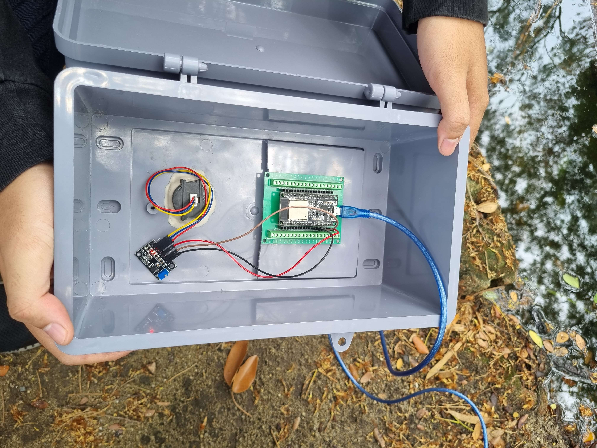
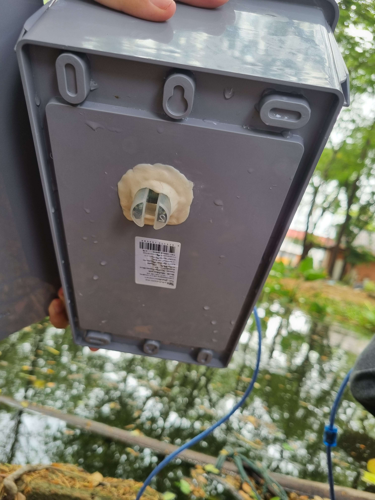

# 💧 Water Turbidity Detection with ESP32 & Stepper Motor

โปรเจกต์ IoT เพื่อตรวจวัดความขุ่นของน้ำ โดยใช้ ESP32 เชื่อมต่อกับเซ็นเซอร์วัดความขุ่น (Turbidity Sensor) และมอเตอร์สเต็ปเปอร์ (Stepper Motor) ซึ่งสามารถนำไปต่อยอดใช้ในระบบกรองน้ำอัตโนมัติหรือแจ้งเตือนคุณภาพน้ำในบ่อเลี้ยงสัตว์น้ำ หรือแหล่งน้ำธรรมชาติได้

---

## 🔧 อุปกรณ์ที่ใช้

- ESP32 Dev Board
- Turbidity Sensor (เช่น SEN0189)
- Stepper Motor (เช่น 28BYJ-48)
- ULN2003 Driver Board
- สาย Jumper
- แหล่งจ่ายไฟ 5V
- ภาชนะอุปกรณ์ (เพื่อทดลองและไม่ให้น้ำเข้าไปทำลาย Sensor)

---

## 🔌 การต่อวงจร (Circuit Diagram)

```plaintext
Turbidity Sensor:
  VCC  -> 3.3V (ESP32)
  GND  -> GND
  AOUT -> GPIO34 (ESP32 ADC Pin)

Stepper Motor (ผ่าน ULN2003):
  IN1 -> GPIO14
  IN2 -> GPIO27
  IN3 -> GPIO26
  IN4 -> GPIO25
  VCC -> 5V External
  GND -> GND (รวมกับ ESP32)
